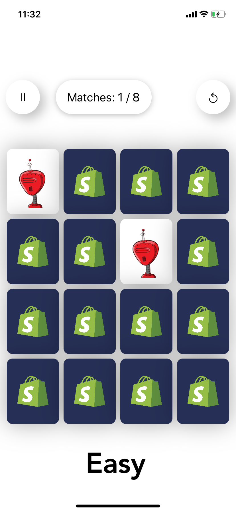
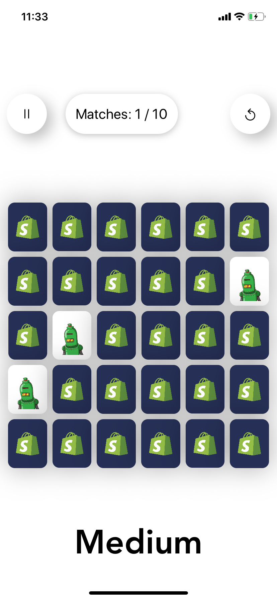
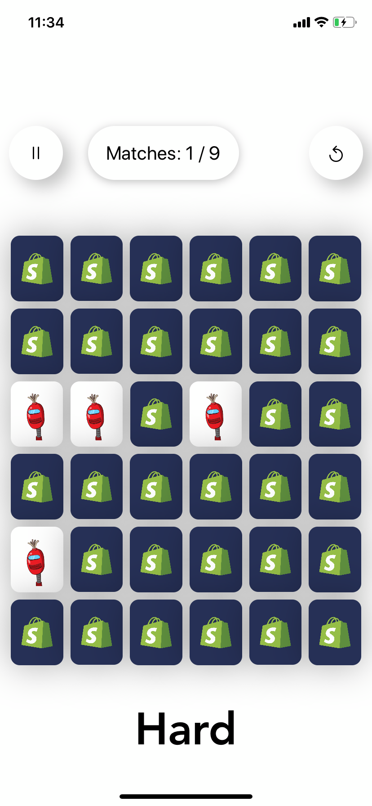

#  Shopify - iOS Internship Summer 2020 Challenge Submission.
## By: Subhan Chaudhry 

<p float="left" align="center">
    
</p>

This is my project submission for the Mobile Developer Intern (iOS) - Summer 2020 Position at Shopify in Toronto, Montreal, and Ottawa. The project challenge can be read at: https://docs.google.com/document/d/1M2VsBSZr8696HU6mO3MWveSB7p3Do9lOkMrjT5nKiEg/edit

This iOS game is a version of the concentration card game known as Memory. 

# Third Party Dependecies
## Packages 

The project has the following third-party dependecies and uses Swift Packagesfor management:

* Alamofire - for HTTP Requests @ https://github.com/Alamofire/Alamofire
* SwiftyJSON - for parsing data @ https://github.com/SwiftyJSON/SwiftyJSON
* Lottie - To render animations natively. @ https://github.com/airbnb/lottie-ios

## Third Party Files 
  * PartcileEmitter - Converts a swift CAAnimationLayer to be usable in SwifTUI.@ https://github.com/ArthurGuibert/SwiftUI-Particless
  
# File Architecture - MVVM 

* This project is built using Apple's new **SwiftUI** - user interface toolkit that lets us design apps in a **declarative way** and the **Combine Framework** - A declarative Swift API for processing values over time.

This project follows the *Model, View, ViewModel (MVVM)* structural design pattern*

**Audio**: Includes the .mp3 assests used in the project. 
**Third-Party**: Includes all third party files used in the project. 
**Services:** Handles API Related code. Utilizes the Alamofire framework.  
**Models:**  Includes custom models to be used to parse API results which houses all the data and game functionality,  and sound. 
**ViewModels:** Includes files that are responsible for exposing the data objects from the model in such a way that objects are easily managed and presented. An example used within the project is the CardsViewModel.
**Assets.xcassets:** Includes all images and colours used for this app
**Extensions**: Includes the extenstions made to any existing swift file.
**ContentView**: The view of the actual game. 
  
# Getting Started

### System Requirements
macOS Catalina or later and Xcode to build this project.

### Instructions
To clone this project in Xcode, click "Clone or download" and select "Open in Xcode".

# Features

## Game Modes 

The game consists of three game modes in which the player is able to choose from: 

### Regular

Achieve all the matches on the cards field. Play at your own pace! 

### Lowest Time

Achieve all the matches on the cards field in the lowest amount of time! 

### One Shot 
When starting your game, all cards on the field will be face-up for 7 seconds. Use this time wisley to memorize the card field because they will be flipped back over! You have only one shot on matching all the cards pairs on the cards field, if you get a pair wrong, you lose! 

## Game Difficulties


Difficulty | Easy | Medium | Hard 
------------ | ------------- | -------------
Number of products per match | 2 Products |  3 Products |  4 Products 
Content in the first column | Content in the second column | 4 | 5


Difficulty | Easy
------------ | -------------
Number of products per match | 2 Products
Grid Size | 4x4

### Easy

* Match 2 of the same product to complete match.  
* Grid size 4x4 

<p float="left">
    
</col>


### Medium 
* Match 3 of the same product to complete match. 
* Grid size: 6x5 

<p float="left">
    
</p>

### Hard

* Match 4 of the same product to complete match. 
* Grid size: 6x6 

<p float="left">
    
</p>

## Extra features

### Restart your game.

* Insert Picture

### Music and Sound

* Turn your volume up as their is sound 

### Pause the game

* Need a break? Feel free to pause the game


```
